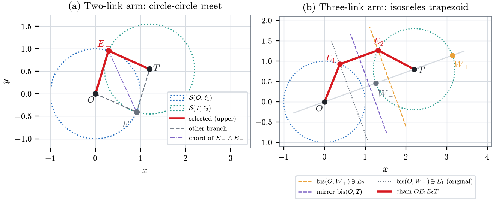
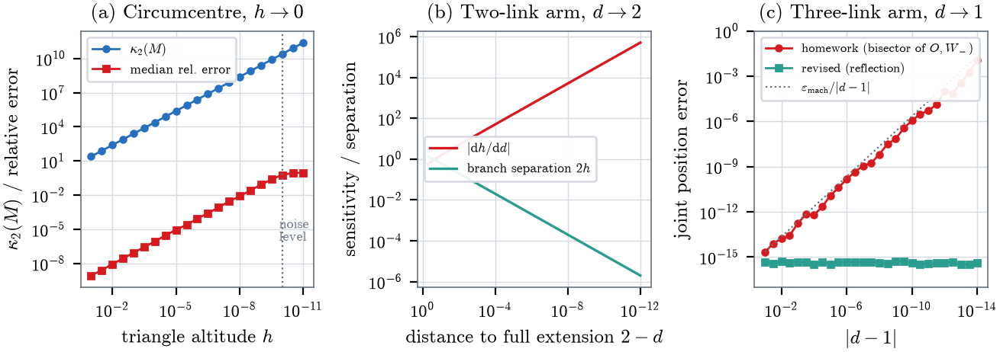
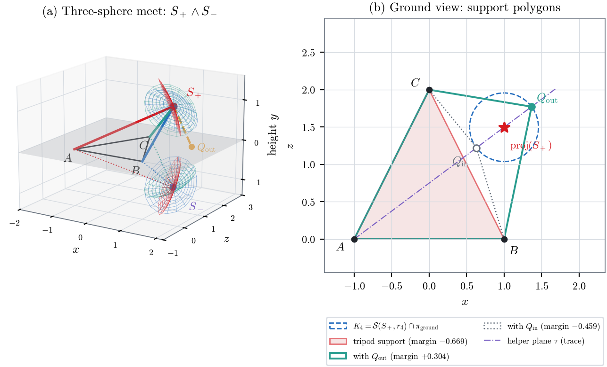
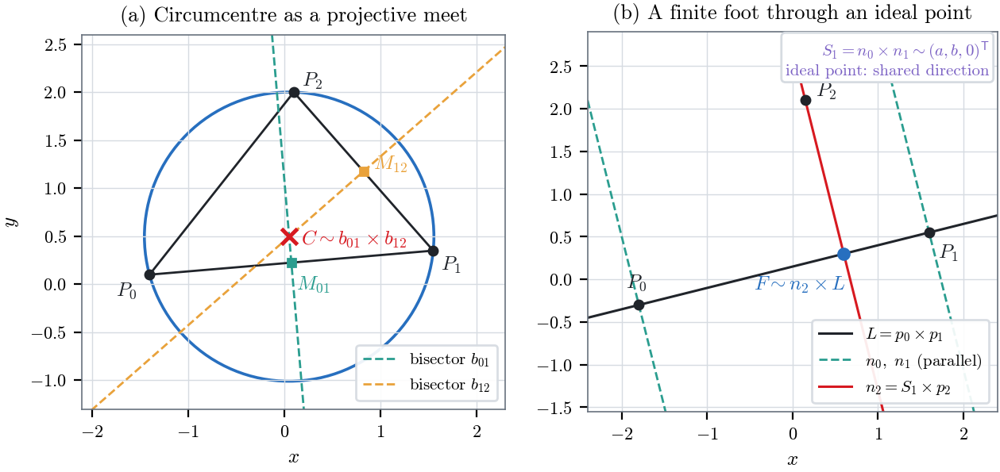
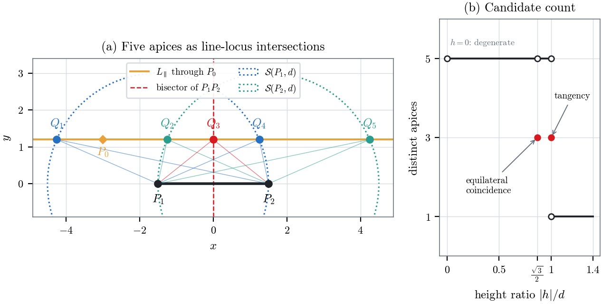

# CGA Robot Kinematics — From Ideal Points to Robot Joints

Computational geometry and inverse kinematics with **projective geometry** and **conformal geometric algebra (CGA)**.

This project studies how geometric constructions can be expressed as algebraic operations on geometric objects rather than as isolated coordinate formulas. The examples range from ideal points and circle constructions in the projective plane to two-link and three-link inverse kinematics, three-sphere intersection, and tripod stability in 3D.

## What This Project Demonstrates

The project combines mathematical modelling, numerical validation, and robotics-oriented geometry:

- a transparent NumPy implementation of the conformal geometric algebra \(G(4,1)\),
- projective constructions using homogeneous coordinates and ideal points,
- two-link and three-link inverse kinematics,
- sphere, plane, circle, and point-pair intersections in CGA,
- explicit branch selection for multiple geometric solutions,
- detection and analysis of geometric and representation singularities,
- static-stability analysis for a tripod with an additional support,
- Monte Carlo validation against independent Euclidean reference formulas,
- CLUCalc implementations of the principal 3D constructions.

The central design idea is a six-stage geometric pipeline:

~~~text
encode -> construct -> intersect -> factor -> select -> validate
~~~

This separates the geometry of the solution set from the application-specific decision of which candidate should be selected.

## Key Results

The checked-in numerical experiment uses seed `20260922` and validates the constructions over thousands of randomly generated configurations.

| Experiment | Samples | Result |
| --- | ---: | ---: |
| Projective constructions | 5,000 | max residual \(3.42\times10^{-14}\) |
| Two-link kinematics | 10,000 | max residual \(4.44\times10^{-16}\) |
| Three-link kinematics | 10,000 | max residual \(4.44\times10^{-16}\) |
| Isosceles-locus candidate count | 19,944 | 0 count mismatches |
| Isosceles-locus residual | 19,944 | max residual \(3.38\times10^{-15}\) |

A particularly important result concerns the three-link construction. The original representation becomes numerically unstable near target distance \(d=1\), although the robot configuration itself is geometrically regular. A reflection-based reformulation removes this representation singularity: across the tested sequence down to \(|d-1|=10^{-14}\), the revised construction remains at approximately machine precision, with a maximum reported position error of \(6.27\times10^{-16}\).

The tripod experiment also illustrates the difference between satisfying distance constraints and obtaining a physically useful configuration. The three-leg support has a negative stability margin of approximately \(-0.669\). Selecting the outer candidate for the fourth support changes the margin to approximately \(+0.304\).

The complete numerical ledger is stored in [`results/results.json`](results/results.json).

## Geometry and Robotics Problems

### Projective Geometry

The planar constructions use homogeneous coordinates in \(\mathbb{P}^2\), where joins and meets are represented by cross products and parallel lines intersect at ideal points.

The repository contains three explicit constructions:

- **Circumcircle construction** — obtains the circumcentre as the meet of two perpendicular bisectors.
- **Perpendicular foot via an ideal point** — represents the common direction of parallel perpendiculars by a point at infinity.
- **Isosceles-triangle locus** — enumerates all admissible apices on a line parallel to the base and analyses when the candidate count changes.

The corresponding course-library programs are in [`projective_geometry/`](projective_geometry/). They depend on the external `libcfcg` teaching library and are therefore separate from the standalone NumPy validation code.

### Two-Link Inverse Kinematics

For a two-link arm with unit link lengths, the elbow is obtained from the intersection of two spheres: one centred at the shoulder and one centred at the target. Their intersection is restricted by a helper plane, leaving a point pair corresponding to the two elbow branches.

The implementation makes branch selection explicit instead of treating the first algebraic solution as automatically correct.

Relevant files:

~~~text
cga_kinematics/two_link_inverse_kinematics.clu
src/geometry.py
src/cga_constructions.py
~~~

### Three-Link Inverse Kinematics

The three-link construction is formulated geometrically as an isosceles-trapezoid problem. The revised formulation selects an auxiliary point explicitly, constructs one elbow from a circle-plane meet, and obtains the other through reflection in the bisector plane of shoulder and target.

This reformulation removes a representation singularity present in the original construction near \(d=1\).

Relevant files:

~~~text
cga_kinematics/three_link_inverse_kinematics.clu
src/geometry.py
src/cga_constructions.py
~~~

### Tripod from Three-Sphere Intersection

The tripod apex is reconstructed as one point of the intersection of three spheres whose centres are the three feet and whose radii are the leg lengths.

A fourth support is then constructed by intersecting:

1. a sphere centred at the selected apex,
2. the ground plane,
3. a vertical helper plane.

The final support point is selected according to static stability rather than algebraic ordering.

Relevant files:

~~~text
cga_kinematics/tripod_sphere_intersection.clu
src/geometry.py
src/cga_constructions.py
~~~

## Conformal Geometric Algebra Engine

[`src/cga.py`](src/cga.py) contains a small NumPy implementation of \(G(4,1)\), the conformal geometric algebra used by the CLUCalc N3 model.

It represents a multivector using the \(2^5=32\) basis blades and implements the operations needed by the constructions in this project, including:

- geometric product,
- outer product,
- inner product,
- left contraction,
- reverse and inverse,
- duality,
- conformal point embedding,
- spheres in OPNS/IPNS form,
- two-object and three-object meets,
- conformal point normalization,
- point-pair classification and extraction.

The goal is transparency rather than performance: the implementation provides an independent numerical environment in which the CLUCalc constructions can be checked against Euclidean reference solutions.

## Numerical Validation

[`src/geometry.py`](src/geometry.py) contains independent Euclidean/projective reference implementations. Each construction returns a structured result containing its status, all candidates, the selected solution, residuals, and diagnostic information.

The numerical study checks:

- projective covariance,
- kinematic distance constraints,
- candidate-count formulas,
- tripod stability,
- conditioning near geometric degeneracies,
- the three-link representation singularity,
- agreement between CGA constructions and independent reference formulas.

Stored numerical outputs are available as both machine-readable and LaTeX-ready files:

~~~text
results/results.json
results/results.tex
~~~

## Repository Structure

~~~text
cga-robot-kinematics/
│
├── src/
│   ├── cga.py
│   ├── cga_constructions.py
│   ├── geometry.py
│   └── generate_figures.py
│
├── cga_kinematics/
│   ├── two_link_inverse_kinematics.clu
│   ├── three_link_inverse_kinematics.clu
│   └── tripod_sphere_intersection.clu
│
├── projective_geometry/
│   ├── circumcircle_construction.py
│   ├── isosceles_triangle_locus.py
│   └── perpendicular_foot_via_ideal_point.py
│
├── tests/
│   ├── conftest.py
│   └── test_geometric_constructions.py
│
├── results/
│   ├── results.json
│   └── results.tex
│
├── figures/
│   ├── isosceles_locus.png
│   ├── kinematic_constructions.png
│   ├── projective_constructions.png
│   ├── stability_analysis.png
│   └── tripod_construction.png
│
├── paper/
│   ├── logo_hda.png
│   ├── main.tex
│   └── references.bib
│
├── .github/
│   └── workflows/
│       └── tests.yml
│
├── .gitattributes
├── .gitignore
├── README.md
├── requirements.txt
└── requirements-dev.txt
~~~

## Figures

The repository includes publication-style figures for the principal constructions and numerical diagnostics.

The isosceles-locus experiment, for example, shows how the number of admissible solutions changes as the parallel line moves relative to the base:

## Technical Report

The accompanying seminar paper is:

**From Ideal Points to Robot Joints — Computational Geometry and Conformal Geometric Algebra**

The LaTeX source and bibliography are stored in [`paper/`](paper/).

The report develops the projective and conformal models, derives the geometric constructions, analyses singular and degenerate cases, and documents the numerical experiments.

## Installation

Clone the repository and install the Python dependencies:

~~~bash
git clone https://github.com/yanaosinchuk/cga-robot-kinematics.git
cd cga-robot-kinematics
python -m venv .venv
pip install -r requirements.txt
~~~

The standalone numerical core uses NumPy; figure generation uses Matplotlib.

The scripts in [`projective_geometry/`](projective_geometry/) additionally use the course-specific `libcfcg` teaching library, which is not bundled with this repository. The CLUCalc scripts in [`cga_kinematics/`](cga_kinematics/) are intended for a CLUCalc environment.

## Testing

Install the development dependencies:

~~~bash
pip install -r requirements-dev.txt
~~~

Run the test suite from the repository root:

~~~bash
python -m pytest -q
~~~

The tests cover conformal point embedding, projective constructions, candidate counts, two-link and three-link kinematic constraints, tripod stability, and agreement between the revised CGA constructions and independent reference solutions.

GitHub Actions runs the same tests on every push and pull request and also executes a reduced end-to-end smoke run of the reproducibility pipeline.

## Reproducing the Numerical Study

Run the full numerical experiment from the repository root:

~~~bash
python src/generate_figures.py
~~~

This regenerates:

~~~text
figures/*.pdf
figures/*.png
results/results.json
results/results.tex
~~~

The full experiment uses the fixed seed `20260922`.

For a faster smoke run:

~~~bash
FAST=1 python src/generate_figures.py
~~~

To redirect generated files to another directory:

~~~bash
OUT_DIR=/tmp/cga-output FAST=1 python src/generate_figures.py
~~~

## Building the Technical Report

First regenerate the numerical results and PDF figures, then compile from the `paper/` directory:

~~~bash
python src/generate_figures.py
cd paper
latexmk -pdf main.tex
~~~

The report reads its numerical macros from `../results/results.tex` and its generated figures from `../figures/`.

## Academic Context

This repository grew out of geometry and geometric-algebra coursework in the B.Sc. Applied Mathematics program at Hochschule Darmstadt.

The accompanying paper records the collaboration and tool-use context of the original course material explicitly. In particular, it states that the Python programs used as part of the source material were developed jointly with a fellow student in the practical part of the course, and it documents the subsequent mathematical review and numerical validation.

## Author

**Yana Osinchuk**  
Applied Mathematics, Hochschule Darmstadt
